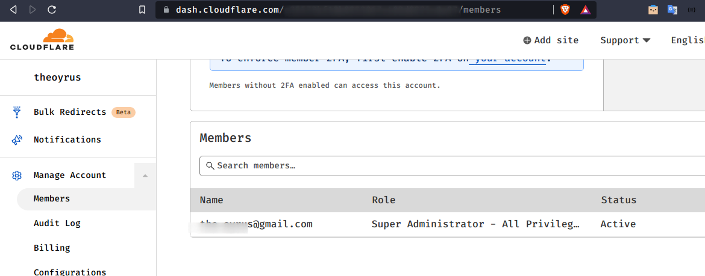
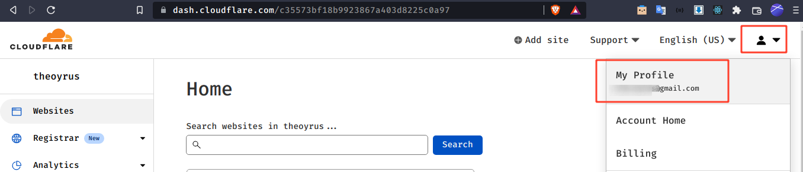
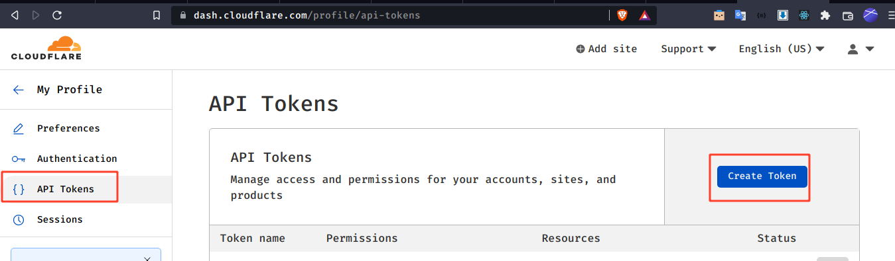
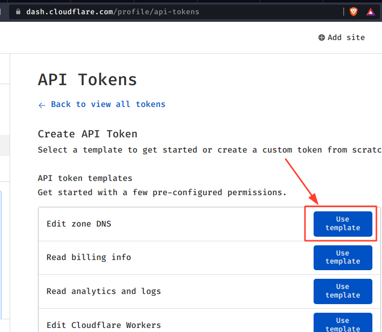
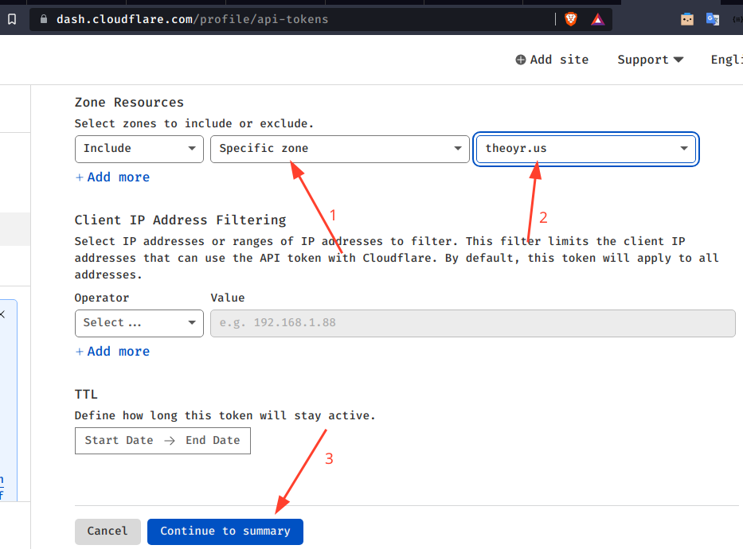
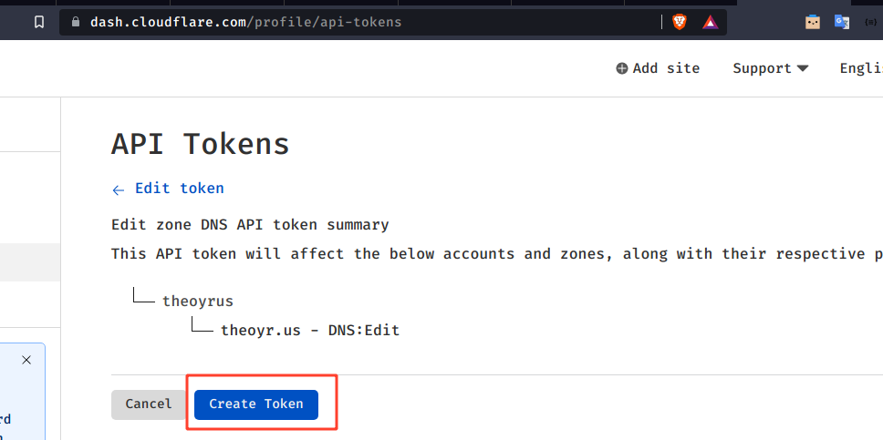

# Traefik v2 Wildcard Lets Encrypt Acme on Cloudflare

<!-- @import "[TOC]" {cmd="toc" depthFrom=1 depthTo=6 orderedList=false} -->

<!-- code_chunk_output -->

- [Traefik v2 Wildcard Lets Encrypt Acme on Cloudflare](#traefik-v2-wildcard-lets-encrypt-acme-on-cloudflare)
    - [Traefik?](#traefik)
    - [Kebutuhan](#kebutuhan)
    - [Struktur Directori:](#struktur-directori)
    - [Langkah konfigurasi](#langkah-konfigurasi)
      - [Sesuaikan file .env](#sesuaikan-file-env)
      - [Sesuaikan file traefik.yml](#sesuaikan-file-traefikyml)
    - [Jalankan Container Traefik](#jalankan-container-traefik)
    - [Mendaftarkan Aplikasi ke Traefik](#mendaftarkan-aplikasi-ke-traefik)
      - [Setup Environment Variable](#setup-environment-variable)
      - [Setup Label](#setup-label)
      - [Docker Network Traefik](#docker-network-traefik)
    - [Mengakses EntryPoint Aplikasi](#mengakses-entrypoint-aplikasi)

<!-- /code_chunk_output -->

### Traefik?

> Traefik is an open-source Edge Router that makes publishing your services a fun and easy experience. It receives requests on behalf of your system and finds out which components are responsible for handling them.

Intinya adalah sebuah tool untuk memudahkan reverse proxy aplikasi kita tanpa harus setting host/ip address & port manual seperti misalnya di nginx. 

Secara pintar si traefik akan membaca setting label dari instance container docker kita tanpa harus repot-repot mengatur ip address maupun portnya. Pun ketika container di-restart, traefik akan otomatis reload.

Saya tidak mengatakan bahwa prosesnya menyenangkan ataupun mudah, tetapi Traefik memang memiliki banyak keunggulan dibandingkan tool lain semisal Nginx, Nginx Proxy Manager, dan Caddy

Untuk perbandingan lebih komprehensif silahkan googling, sudah banyak yang menjelaskan :D

### Kebutuhan

1. DNS Manager (Cloudflare)
Pertama dan terpenting, Sertifikat Wildcard dari Let's Encrypt hanya dapat dikeluarkan dengan DNS challenge. Ini berarti kita perlu kontrol langsung atas entri DNS kita. Saya menggunakan Cloudflare, yang mana terdaftar sebagai salah satu provider/penyedia yang didukung dalam dokumentasi Traefik HTTPS & TLS (https://doc.traefik.io/traefik/https/acme/).
&nbsp;
Cloudflare ini free untuk kebutuhan DNS, silahkan daftar dan atur entri NS dari VPS anda ke Cloudflare, sudah banyak contohnya di internet :D
&nbsp;

2. Docker di VPS
Karena traefik kita akan dijalankan di docker, silahkan ikuti langkah di bawah.


### Struktur Directori:
```
├── certs/
│   └── .gitignore
├── docker-compose.yml
├── .env.example
├── .gitignore
├── README.md
└── traefik/
    ├── config.yml
    └── traefik.yml
└── web-sample/
    ├── docker-compose.yml
    ├── .env.example
    └── www/
        └── index.html
```
Secara singkat repo ini berisi:
- certs/
Direktori ini akan berisi acme.json hasil generate DNS Challenge dari server Acme ke Cloudflare yang mengarah ke vps kita.
- traefik/
Direktori ini untuk mengatur konfigurasi traefik, silahkan sesuaikan sesuai konfigurasi yang kita inginkan. 
- web-sample/
Direktori ini untuk contoh container aplikasi yang akan dikelola traefik, sebuah web biasa berisi index.html yang berjalan di web-server nginx 
- .env.example
Silahkan sesuaikan isian environment sesuai milik anda, lalu save as menjadi .env

### Langkah konfigurasi
#### Sesuaikan file .env

```ACME_EMAIL=email@domain.tld```, merupakan email aktif kita sebagai syarat menggunakan ACME Lets Encrypt, yang dalam hal ini akan kita samakan dengan email terdaftar di akun Cloudflare. Atau bisa lihat di menu Manage Account > Member



```DOMAIN=sub.domainmu.tld```, merupakan base url dari traefik kita, karena VPS punya saya di sebuah subdomain maka saya setting sesuaikan di url subdomain. Jika anda di root domain, sesuaikan dengan alamat anda.

```CLOUDFLARE_EMAIL```, adalah email yang terdaftar di akun Cloudflare, seperti yang ```ACME_EMAIL```

```CLOUDFLARE_DNS_API_TOKEN```, adalah token API Cloudflare agar bisa memanipulasi entri DNS kita

Langkah-langkah mendapatkan DNS API Token Cloudflare:
1. Masuk Profil

&nbsp;

2. Pilih menu API Tokens, klik Create Token

&nbsp;

3. Pilih Use template Edit zone DNS

&nbsp;

4. Atur Zona Resource mana yang kita perbolehkan untuk di-manage via API, lalu Continue to summary

&nbsp;

5. klik Create Token jika sudah yakin benar apa yang kita pilih

&nbsp;

```HTTPPASSWD=USER:HTTPDPASS```, merupakan pengaturan akses traefik dashboard kita (akses: https://traefik.domain.tld). Ketika diakses kita perlu mengisi user & password agar terproteksi dan tidak sembarangan diakses.

Untuk USER isi dengan username anda atau bebas, HTTPDPASS ini diisi dengan hasil generate password HTTP, anda bisa menggunakan layanan online semacam https://www.web2generators.com/apache-tools/htpasswd-generator

Berikut contoh format isian variabel tersebut, 
```usernamekamu:$apr1$sw2d6oj5$OjkwRvg7fz2vdJMw9LWPJ.```


#### Sesuaikan file traefik.yml
Sesuaikan email Cloudflare anda pada bagian 
```
certificatesResolvers:
  cloudflare:
    acme:
      email: your.name@gmail.com
```

### Jalankan Container Traefik

Masuk ke shell VPS anda, lalu masuk di direktori kerja repo ini create container traefik dengan perintah docker-compose, silahkan install jika belum.

```
docker-compose up -d
```

akan membuat container bernama ```traefik```, untuk menghentikannya jalankan perintah

```
docker-compose down
```

Kita bisa coba cek traefik dengan mengakses https://domain.tld, namun biasanya akan muncul 404 Not Found karena entrypoint (port:80) belum diatur.

### Mendaftarkan Aplikasi ke Traefik

#### Setup Environment Variable

Sebagai contoh sudah ada direktori web-sample. Terdapat konfigurasi di file .env, hal ini sebenarnya hanya kustomisasi yang biasa saya lakukan agar konfigurasi ataupun secret tidak masuk ke dalam source control semacam git.

**.env**, save as dari **.env.example**

```DOMAIN=web.domain.tld``` adalah path ataupun domain yang akan kita tentukan sebagai entrypoint container app kita diakses, contoh ini menggunakan subdomain, anda bisa mengatur misalnya sebagai alamat utama domain.tld jika ingin port 80 VPS kita mengakses web ini.

Atau jika ingin di dalam sebuah path, maka isiannya kita ubah menjadi misalnya ```DOMAIN=domain.tld/web```, maka ketika ada entrypoint https://domain.tld/web si traefik akan membaca entrypoint tersebut sebagai route yang akan mengakses web kita di dalam docker.

```TR_APP=web``` ini adalah kode unik dari container kita, misalnya kita namai web sebagai identitas instance/container.

```
TR_PORT=80
```
ini adalah port yang di-expose container kita agar bisa dibaca oleh traefik, sesuaikan port ini dengan port yang di-expose dari Dockerfile atau image docker yang kita gunakan.

```
TR_PATH=web
```
ini adalah prefix path jika container ingin diakses menggunakan path bukan level domain/subdomain.

#### Setup Label

Inilah bagian mudahnya mendaftarkan container app kita ke traefik, hanya mengatur label container yang ada di docker-compose.yml aplikasi kita.

Buka file **docker-compose.yml** aplikasi yang akan didaftarkan traefik, lalu tambahkan label-label seperti berikut.
```
labels:
  - "traefik.enable=true"

  # beri nama router unik, entrypoint ambil dari traefik.yml
  - "traefik.http.routers.${TR_APP}-secure.entrypoints=https"
  # beri nama router unik & tentukan domain atau pathnya
  - "traefik.http.routers.${TR_APP}-secure.rule=Host(`${DOMAIN}`)"
  # jika pakai path, uncomment baris dibawah ini
  # - "traefik.http.routers.${TR_APP}-secure.rule=Host(`${DOMAIN}`) && PathPrefix(`/${TR_PATH}`)"
  # servicename ini, samakan dengan baris dibawah ini
  - "traefik.http.routers.${TR_APP}-secure.service=${TR_APP}-secure"
  # ya, servicename yg ini, begitupun port yang di-expose
  - "traefik.http.services.${TR_APP}-secure.loadbalancer.server.port=${TR_PORT}"
  - "traefik.http.routers.${TR_APP}-secure.tls=true"
```

Sudah saya beri pejelasan singkat apa maksud label tersebut, dan label tersebut sudah di-set minimal agar bisa menjalankan container dan wildcard ssl. Jika ingin lebih detail mempelajari dokumentasi traefik di docker, silahkan akses dokumentasi traefik https://doc.traefik.io/traefik/providers/docker/

#### Docker Network Traefik

Ada dua opsi menjalankan network docker untuk traefik kita: 
1. Menggunakan network yang telah kita atur misal namanya ```proxy```, atau apapun

Jika menggunakan custom network docker misal namanya ```proxy``` maka kita perlu mendaftarkan container child yang akan kita kelola agar masuk/dikelola traefik dengan mengisi network yang sama dengan docker network tersebut, contoh di **docker-compose.yml** perlu ada konfigurasi

```
networks:
  proxy:
    external: true

```

Ini dimaksudkan agar container ini masuk/satu jaringan dengan network yang sudah kita buat di traefik, sehingga urusan edge route akan diserahkan ke traefik.

2. Menggunakan docker network mode bridge

Secara default di repo ini menggunakan network mode bridge, ini dimaksudkan agar sample contoh mudah dipahami dan container tidak perlu secara manual di daftarkan ke proxy network yang dibuat. Namun hal ini dikembalikan kepada preferensi anda.

### Mengakses EntryPoint Aplikasi

Selesai konfigurasi, maka kita coba jalankan container app dengan shell masuk ke direktori aplikasi kita, lalu eksekusi

```
docker-compose up -d
```

akan menjalankan container aplikasi sesuai docker-compose.yml.

Kita bisa coba cek aplikasi kita dengan mengakses https://domain.tld atau path yang sudah kita atur misalnya https://domain.tld/web.

Ada kendala? Silahkan create issue :)